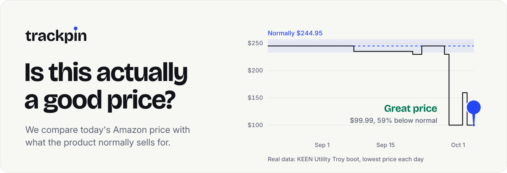

<picture>
  <source media="(prefers-color-scheme: dark)" srcset="banner-dark.svg">
  
</picture>

Paste an amazon.com link into [TrackPin](https://trackpin.co) and it tells you whether today's price is actually good. It compares the price with what the product normally sells for, not with the crossed-out price on the listing.

### How the verdict works

1. We record every price we see, and when we saw it.
2. We find the normal price: the lowest level the product held for at least 15% of the last 45 days.
3. We compare today with normal. Below it is a good price, within 5% is normal, above it is above normal.

Browse [real deals](https://trackpin.co/deals), read [how it works](https://trackpin.co/how-it-works), or get price history through the [API](https://trackpin.co/developers).

Not affiliated with Amazon.
