<picture><source media="(prefers-color-scheme: dark)" srcset="hero-dark.svg"></picture>

Paste an amazon.com link into [TrackPin](https://trackpin.co) and it tells you whether today's price is actually good. It compares the price with what the product normally sells for, not with the crossed-out price on the listing.

<picture><source media="(prefers-color-scheme: dark)" srcset="verdicts-dark.svg"></picture>

  <a href="https://trackpin.co"><picture><source media="(prefers-color-scheme: dark)" srcset="btn-check-dark.svg"></picture></a>
  <a href="https://trackpin.co/deals"><picture><source media="(prefers-color-scheme: dark)" srcset="btn-deals-dark.svg"></picture></a>
  <a href="https://trackpin.co/how-it-works"><picture><source media="(prefers-color-scheme: dark)" srcset="btn-how-dark.svg"></picture></a>
  <a href="https://trackpin.co/developers"><picture><source media="(prefers-color-scheme: dark)" srcset="btn-api-dark.svg"></picture></a>

Not affiliated with Amazon.
